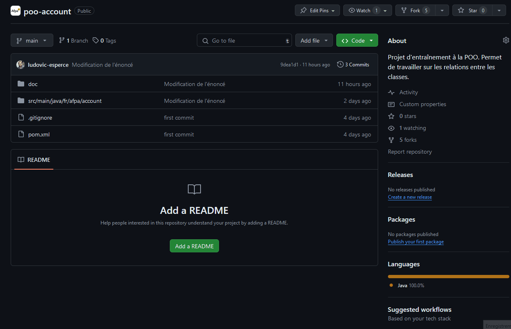

# Programmation objet : gestion de compte bancaire

## Objectifs d'apprentissage

Liste des compétences abordées :
- création de classes ;
- implémentation de méthodes (**"non-static"** et **"static"**); 
- mise en place de mécanismes de programmation défensive.

## Travail à effectuer

Un énoncé sous format PDF est disponible dans le sous-dossier "doc" de ce projet.

Cet énoncé vous donne les grandes lignes du développement. Il vous est demandé de suivre les indications de l'énoncé afin de compléter les **"TODO"** du code source.

Pour effectuer une copie du projet dans votre **espace personnel** vous pouvez faire un "fork".

